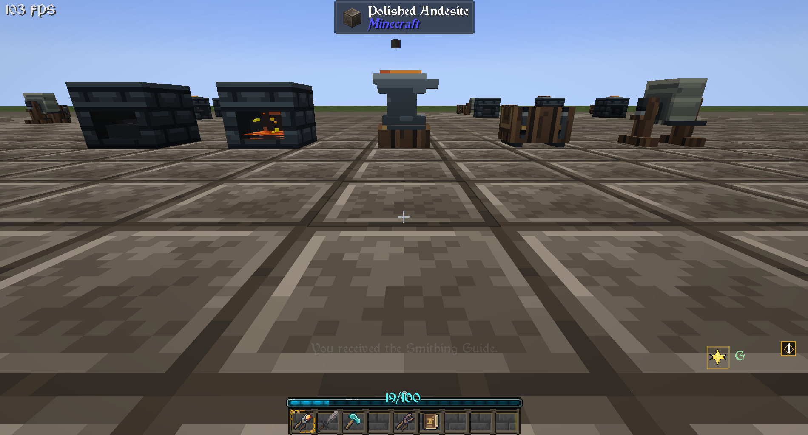
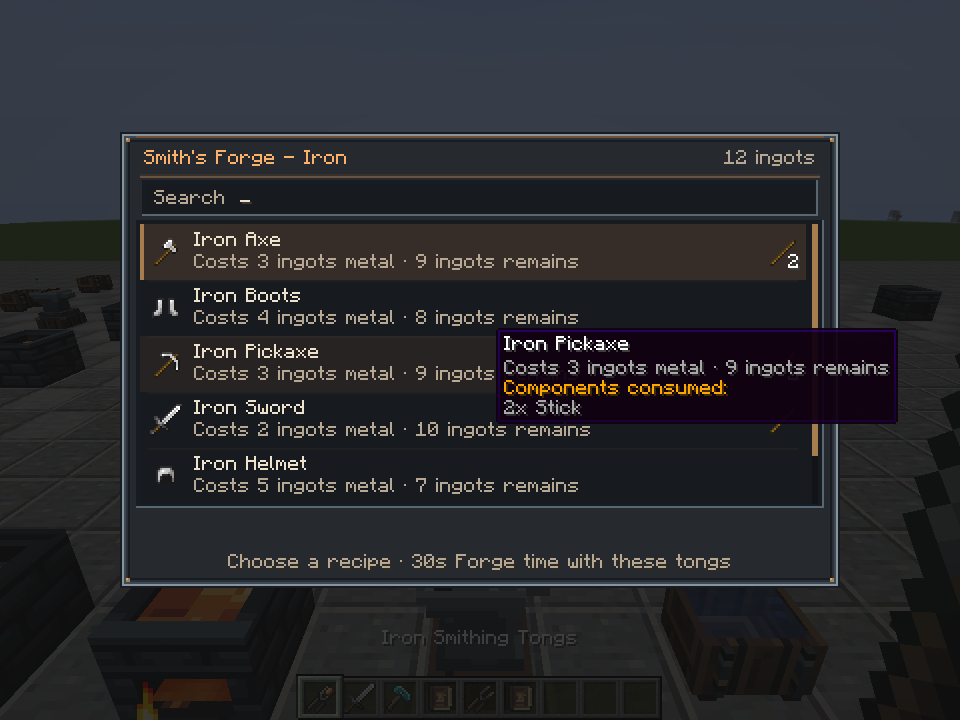
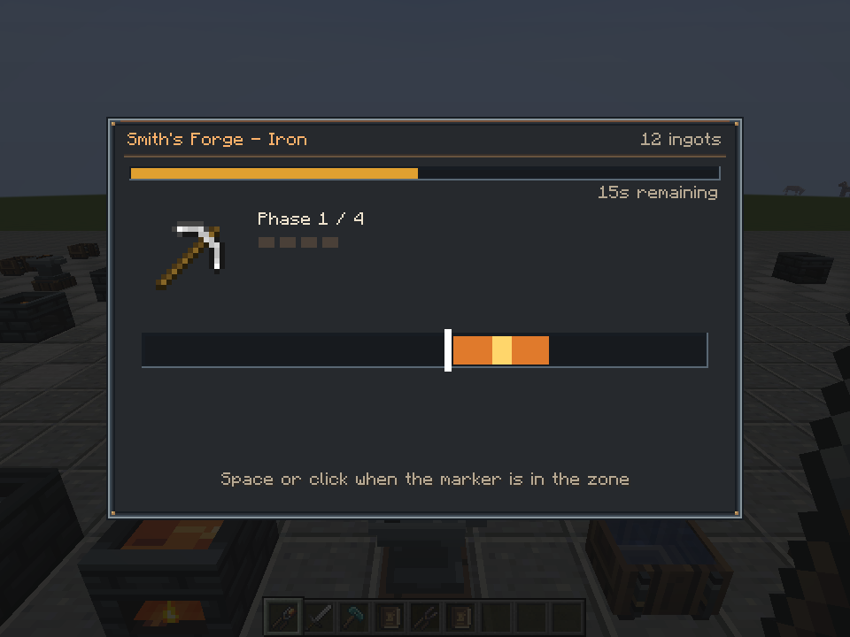
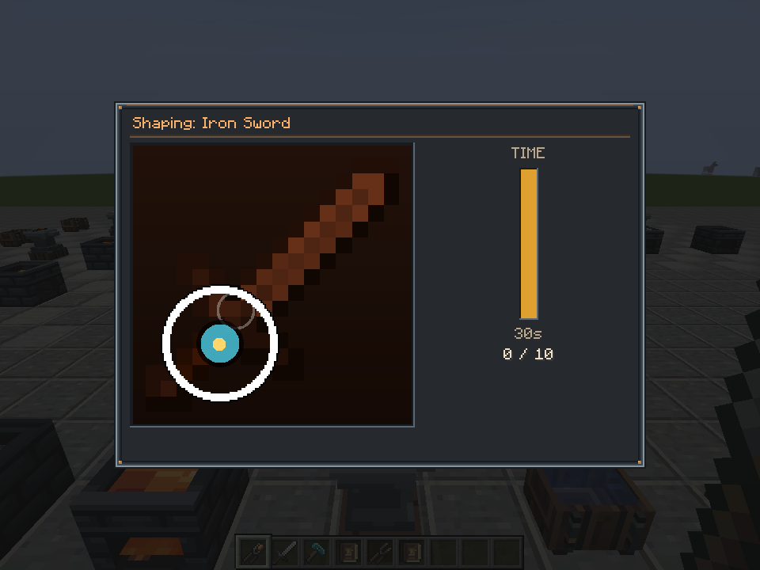

# Immersive Smithing

Metal equipment is forged, not crafted. Melt metal in the Smith's Forge, shape it on the Smith's Anvil and quench it
in the Smith's Trough. Your skill in two short minigames decides the durability and efficacy of what you make.

A Forge mod for Minecraft 1.20.1.



| Choosing a recipe | Forge minigame | Anvil minigame |
| --- | --- | --- |
|  |  |  |

## How it works

1. Put metal (ingots, nuggets, raw metal, storage blocks or old metal equipment) into the top of a Smith's Forge
   and fuel into the bottom.
2. Ignite the fuel with Flint and Steel or a Fire Charge and wait for the metal to melt. Lava needs no ignition,
   and netherite melts only with lava.
3. Use Smithing Tongs on the forge, choose an item and play the **Forge minigame**: press Space or click while the
   sweeping marker is inside the glowing zone.
4. Carry the hot workpiece to a Smith's Anvil and play the **Anvil minigame** with a Smithing Hammer: strike each
   target when the closing ring touches it.
5. Pick the workpiece up with the tongs and quench it in a Smith's Trough filled with water.

Stone tongs and a stone hammer are enough to start, and the whole process takes about a minute. Most metal weapons,
tools and armor can no longer be made at a crafting table. Players receive the Smithing Guide, an in-game book
with the details, the first time they obtain smithing tongs or a hammer.

## Stations and tools

| Block or item | Crafted from | Purpose |
| --- | --- | --- |
| Smith's Forge | 5 bricks, a furnace, 3 cobblestone, blackstone or cobbled deepslate | Melts metal. Metal goes on top, fuel below. |
| Smith's Anvil | 3 iron ingots, 4 stone bricks | Shapes hot workpieces with a Smithing Hammer. |
| Smith's Trough | 7 wooden slabs, an iron ingot | Quenches shaped workpieces in water. |
| Smith's Grindstone | a diamond, 2 iron ingots, a grindstone | Refines smithed equipment for experience. |
| Smithing Tongs and Smithing Hammer | 3 stone, iron ingots or diamonds and 2 sticks; netherite: the diamond tool and a netherite ingot | Start forging and carry workpieces; strike at the anvil. |
| Smithing Guide | a book and coal or charcoal | The in-game guide. |

Tongs and hammers come in stone, iron, diamond and netherite. Higher tiers give more time in the minigames (30,
35, 40 and 45 seconds) and last longer, but never add quality on their own. They can be repaired with their
material at an anvil and accept Unbreaking and Mending.

## Quality

Every smithed item carries two scores from 0 to 100.

- **Forge score** sets durability: 75% of normal at 0, normal at 50, 125% at 100.
- **Anvil score** sets efficacy: attack damage for weapons, mining speed for tools and armor points for armor.
  85% at 0, normal at 50, 115% at 100.

The average of both scores gives the item's label:

| Label | Average score |
| --- | --- |
| Crude | below 35 |
| Standard | 35 to 69 |
| Fine | 70 to 89 |
| Masterwork | 90 and above |

If the anvil timer runs out, the item is **Faulty**: half durability and 70% efficacy. The Smith's Grindstone adds
5 points to one score for experience levels, up to 100, and keeps enchantments; it cannot refine Faulty items.
Any metal equipment the forge recognises, enchanted or Faulty, can be melted back down, and all of its metal is
recovered by default. Equipment without smithing data, such as loot, behaves like Standard.

## Metals

Metal is measured in units: a nugget is 1, an ingot or raw ore 9 and a storage block 81. An iron sword costs 18
units (two ingots) plus a stick.

Iron, gold, copper and netherite families are built in. Tin, bronze, steel, silver, electrum, lead, nickel,
invar, constantan, platinum and aluminum have definitions that apply when another mod supplies them, and any other
`forge:ingots/<metal>` tag becomes a material family automatically. Families melt at different speeds: gold
quickly, netherite slowly.

Netherite equipment is forged straight from netherite ingots, with no smithing template or diamond equipment.
Smithing-table upgrades from other mods, such as netherite shields and weapons, are forged the same way, and the
smithing-table recipe is disabled. Armor trims are never affected.

## Other mods

- **Automatic detection.** Crafting recipes for weapons, tools, armor and metal shields that use exactly one metal,
  plus components such as sticks or leather, become smithing recipes and the crafting recipe is disabled. Recipes
  that mix metals or are otherwise unclear are left alone. A metal shield built on a wooden base shield needs only
  the metal.
- **Spartan Weaponry** is supported out of the box: every metal weapon of all 24 types, including throwing weapons,
  longbows and heavy crossbows, has its own recipe and anvil pattern. A thrown weapon keeps its quality in flight,
  and arrows and bolts take the quality of the bow or crossbow that fires them.
- **JEI** (optional) shows every smithing recipe, detected ones included, in a Smithing category, and hides the
  crafting recipes that smithing replaced.
- The automated tests also run with Spartan Weaponry, Spartan Shields and Immersive Armors installed.

Datapacks can add or override material families, smithing recipes, recycling values and minigame patterns. The
formats and the Java/IMC API are documented in [docs/API.md](docs/API.md).

## Multiplayer and automation

The server runs the minigames: clients only send their key presses, and the server checks timing and scores
them. While someone works at an anvil, nobody else can take or start its workpiece.

Hoppers and pipes can feed metal and fuel into a forge and water into a trough, and comparators read both.
Automation can never choose a recipe, play a minigame, move a workpiece or quench it.

Toolsmiths and Weaponsmiths sell tongs and hammers. They and Armorers also sell iron equipment forged at a random
quality, never Faulty by default.

## Configuration

`immersive_smithing-server.toml` (per world, synced to clients) covers recipe replacement and automatic detection,
forge capacity and fuel, minigame times, quality multipliers, recycling, the trough and grindstone, villager
trades, automation faces and the Spartan Weaponry integration. Run `/reload` after changing recipe options.

`immersive_smithing-client.toml` covers presentation only: numeric quality scores in tooltips, reduced screen shake
and flashes, particle amount, high-contrast minigames, larger and colorblind-safe targets, and timing cue sounds.
These options never widen scoring windows.

## Commands

Operators (permission level 2):

| Command | Purpose |
| --- | --- |
| `/immersivesmithing reload` | Full datapack reload. |
| `/immersivesmithing material <item>` | Family, units and the rule that matched, or the recycling value. |
| `/immersivesmithing recipe <item>` | Smithing recipes for the item and the recipes they disabled. |
| `/immersivesmithing quality` | Quality and multipliers of the held item. |
| `/immersivesmithing report` | Writes `logs/immersive_smithing_report.txt` with every detection decision. |
| `/immersivesmithing session` | Active minigame sessions. |

## Requirements

- Minecraft 1.20.1 with Forge 47 or later, Java 17.
- Install on both the client and the server.
- Optional: Just Enough Items.

## Building

```sh
./gradlew build                  # jar in build/libs/
./gradlew runGameTestServer      # headless GameTests
./gradlew runGameTestServer -PcompatMods   # the same with Spartan Weaponry, Spartan Shields and Immersive Armors
```

Artwork sources and Blockbench model notes are in [art/README.md](art/README.md).

## License

GPL-3.0. See [LICENSE](LICENSE).
