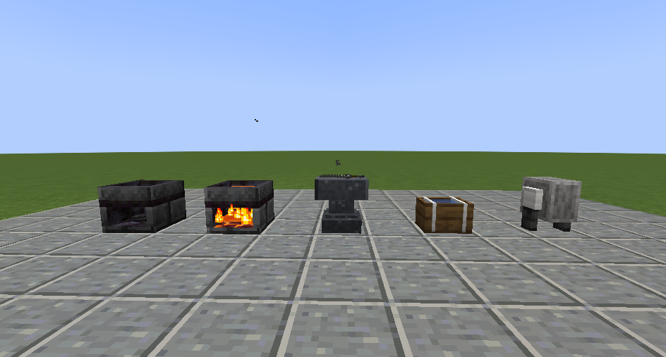
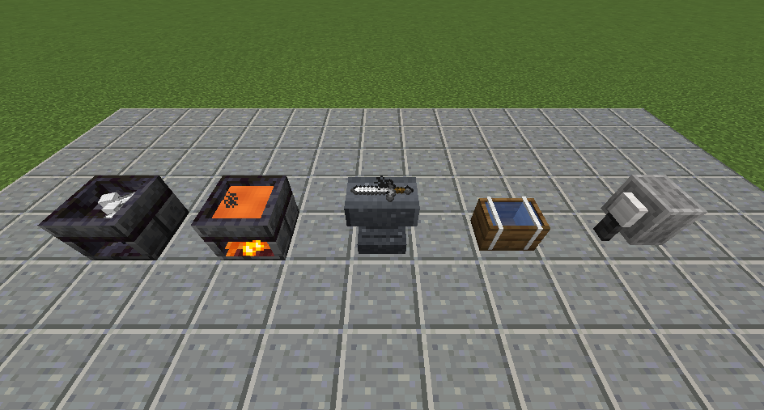
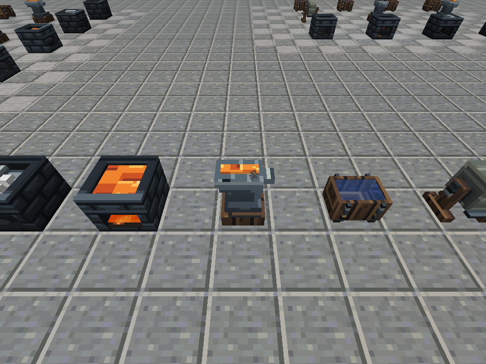
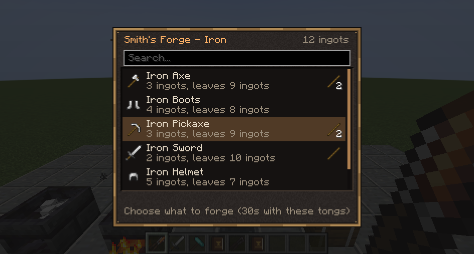
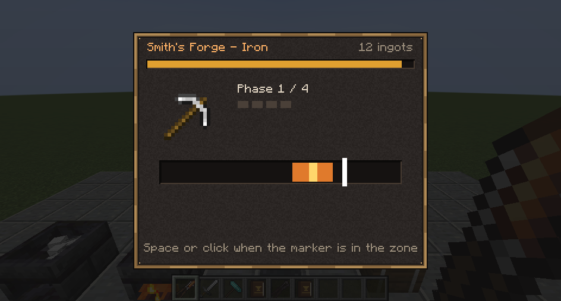
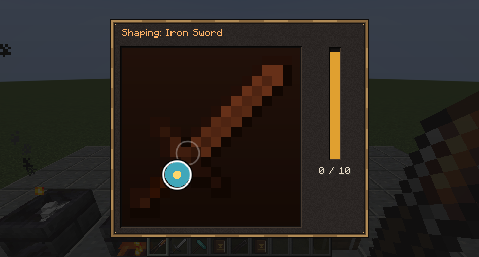
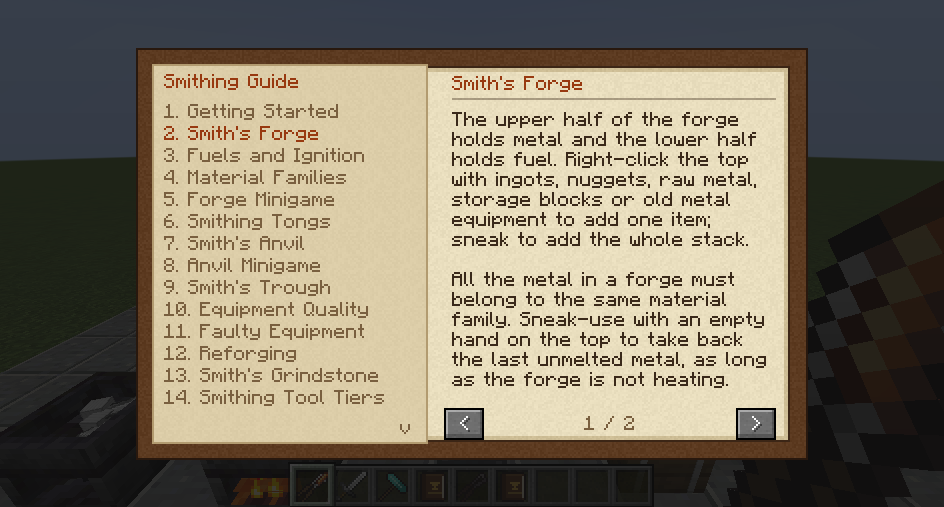
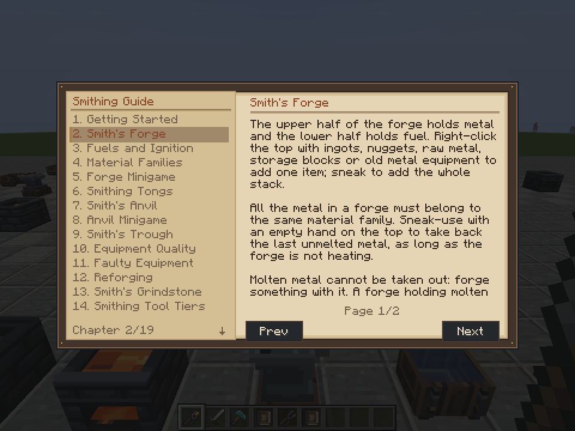

# Before and after

Actual Minecraft screenshots, captured with ordinary rendering and no shader pack. The baseline was recorded on clean `main` at `3840ff0` before editing. Viewports differ between the desktop baseline and the isolated final capture; these are visual comparisons, not pixel-difference tests. Ultima images include that pack's fonts, floor textures and HUD. Open an image for its original resolution.

| View | Before | After |
| --- | --- | --- |
| Stations, front |  |  |
| Stations, above |  |  |
| Forge recipes |  |  |
| Forge minigame |  |  |
| Anvil minigame |  |  |
| Guide |  |  |
| Tongs, first person | [Baseline](before/packtest_tongs_first_person.png) | [Finished](after/packtest_tongs_first_person.png) |
| Tongs, third person | [Baseline](before/packtest_tongs_third_person.png) | [Finished](after/packtest_tongs_third_person.png) |

## Additional coverage

- All station states in the four orientations: [north](after/packtest_stations_north_day.png), [east](after/packtest_stations_east_day.png), [south](after/packtest_stations_south_day.png), [west](after/packtest_stations_west_day.png), and [night](after/packtest_stations_night.png).
- All tool tiers: [inventory in Ultima](after/ultima/packtest_inventory_tools_scale_3.png), [quality tooltip](after/ultima/packtest_inventory_quality_tooltip.png). [JEI](after/packtest_jei_smithing.png), [JEI with pack equipment](after/ultima/packtest_jei_smithing.png).
- Exact 320×240 logical GUI: [long recipe names](after/packtest_forge_long_320x240.png), [anvil](after/packtest_anvil_320x240.png), [guide](after/packtest_guide_320x240.png). Long names are synthetic layout fixtures.
- Accessibility settings enabled: [forge](after/packtest_forge_accessibility.png), [anvil](after/packtest_anvil_accessibility.png).
- Feedback: [forge countdown](after/packtest_forge_countdown.png), [forge result](after/packtest_forge_result.png), [anvil countdown](after/packtest_anvil_countdown.png), [anvil result](after/packtest_anvil_result.png).
- Action effects: [quench](after/packtest_effect_quench_real_action.png), [grinding](after/packtest_effect_grind_real_action.png), [strike](after/packtest_effect_anvil_server_packet.png). Quenching and grinding invoke real server station actions; the strike image uses the existing server effect packet directly.
- [32 active forges](after/packtest_performance_32_active.png). Timing methodology and limitations are in the [validation report](REPORT.md).
- Multiplayer: [remote idle](after/multiplayer/packtest_multiplayer_remote_idle.png), [tongs thrust](after/multiplayer/packtest_multiplayer_remote_tongs_swing.png), [hammer strike](after/multiplayer/packtest_multiplayer_remote_hammer_swing.png), [first-person tongs](after/multiplayer/packtest_multiplayer_first_person_tongs.png), [first-person hammer](after/multiplayer/packtest_multiplayer_first_person_hammer.png). Vanilla night vision is enabled in the final pose fixture. A separate [zero-light capture](after/multiplayer/packtest_hot_tongs_zero_light.png) verifies the hot layer's emission.

The [validation report](REPORT.md) also links the packaged Ultima and two-client multiplayer evidence.
